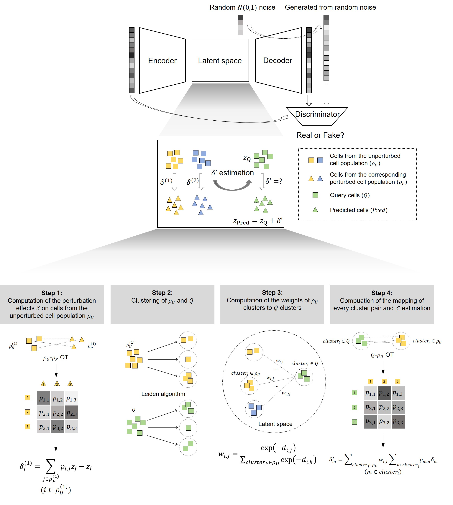

## Predicting single-cell perturbation responses across biological contexts with a deep generative model integrating optimal transport

**Authors**: \#Jialiang Wang, \#Ziqi Liu, \#Zhengqian Zhang, Yikun Cao, Junjun Ren, Peng Cheng, Jingjing Tian, Lingyun Xie, \*Zhanwei Du, \*Yongzhuang Liu

\# Equal contribution.

\* Corresponding author.

<p align='center'> </p>

Predicting how individual cells respond to diverse perturbations is a central problem in computational biology and a cornerstone for building artificial intelligence virtual cells (AIVCs) and advancing drug discovery. However, the wide diversity of perturbation factors, which encompassing chemical, genetic, and physical perturbations, and the limited generalizability of current models, make cross-context prediction across cell types, tissues, organs, patients, and species particularly challenging. To address this challenge, we present single-cell perturbation inference via latent optimal transport (scPILOT), a deep generative model that integrates optimal transport for perturbation prediction across biological contexts. The new framework increases the interpretability of perturbation modelling and the quality of the generated cells and prevents overfitting. scPILOT accurately captures responses across cell types (average squared Pearson correlation between the means of perturbed and predicted gene expression levels R<sup>2</sup><sub>mean</sub>=0.959, maximum mean discrepancy MMD=0.126), patients (average R<sup>2</sup><sub>mean</sub>=0.558, MMD=0.026), and species (average R<sup>2</sup><sub>mean</sub>=0.866, MMD=0.240). With the rapid increase in the number of available single-cell perturbation datasets, scPILOT may facilitate the modelling of cellular behaviour under perturbations, enabling the construction of AIVCs and promoting drug discovery.

## Installation

To setup the corresponding `conda` environment run:
```
conda create --name scPILOT python=3.12.2
conda activate scPILOT
pip install --upgrade pip
```
Install requirements and dependencies via:
```
pip install adjustText==1.1.1
pip install anndata==0.10.6
pip install matplotlib==3.8.4
pip install numpy==1.26.4
pip install pandas==2.2.3
pip install POT==0.9.4
pip install scikit-learn==1.4.1.post1
pip install scipy==1.13.0
pip install scvi-tools==1.1.2
pip install seaborn==0.13.2
pip install setuptools==68.2.2
pip install torch==2.2.2
```
To install `scPILOT` run:
```
python setup.py develop
```

## Datasets
The datasets used in this work can be downloaded from https://zenodo.org/records/17827977.

## Reproducibility
The results can be reproduced with the datasets and scripts we provide.

## Contact
In case you have questions, please contact Jialiang Wang through 18846091447@163.com.