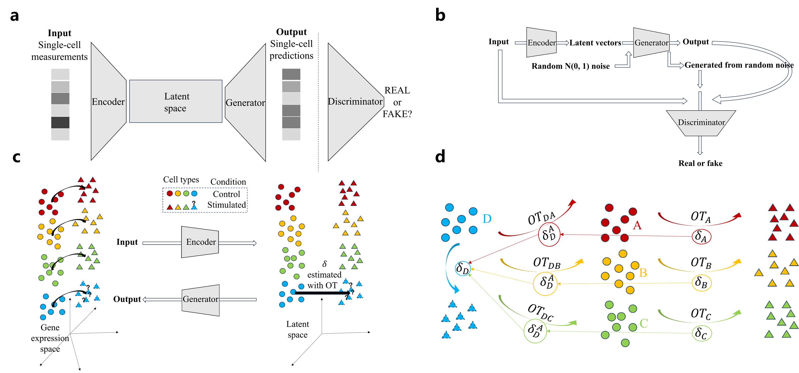

## scPILOT: single-cell perturbation prediction of individual cells with a generative model integrating optimal transport

**Authors**: \#Jialiang Wang, \#Ziqi Liu, \#Zhengqian Zhang, Junjun Ren, Peng Cheng, Jingjing Tian, Lingyun Xie, Yikun Cao, Congjing Hu, Junzhao Huang, Tianshuo Yu, Jiayu Wang, \*Yongzhuang Liu

\# Equal contribution.

\* Corresponding author.

<p align='center'> </p>

Promoting drug discovery with data science methods for perturbation prediction is becoming a vital issue in bioinformatics. Due to an inherent defect of scRNA-seq technologies that a cell is usually destroyed during sequencing, researchers can only get unperturbed and perturbed cells that do not match. This makes it challenging to model the heterogeneous responses of individual cells. In this paper, we present scPILOT, a perturbation prediction approach combining the advantages of variational autoencoder and optimal transport. By conducting several experiments, we demonstrate that scPILOT outperforms state-of-the-art approaches from multiple perspectives. We illustrate the generalization capacity of scPILOT by (1) predicting responses of unseen cell types and unseen lupus patients to interferon-beta (IFN–β); (2) predicting responses of unseen cell lines to many kinds of drugs; (3) predicting lipopolysaccharide effects on animals across species; and (4) predicting cell development across cell populations.

## Installation

To setup the corresponding `conda` environment run:
```
conda create --name scPILOT python=3.12.2
conda activate scPILOT
pip install --upgrade pip
```
Install requirements and dependencies via:
```
pip install adjustText==1.1.1
pip install anndata==0.10.6
pip install matplotlib==3.8.4
pip install numpy==1.26.4
pip install pandas==2.2.3
pip install POT==0.9.4
pip install scgen==2.1.0
pip install scikit-learn==1.4.1.post1
pip install scipy==1.13.0
pip install scvi-tools==1.1.2
pip install seaborn==0.13.2
pip install setuptools==68.2.2
pip install torch==2.2.2
```
To install `scPILOT` run:
```
python setup.py develop
```

## Datasets


## Experiments
After downloading the datasets, the results of scPILOT, scGen, VAEGAN, and identity can be reproduced with the scripts we provide. The results of CellOT and biolord need adaptation according to their requirements and our experiment settings.

## Contact
In case you have questions, please contact Jialiang Wang through 18846091447@163.com.