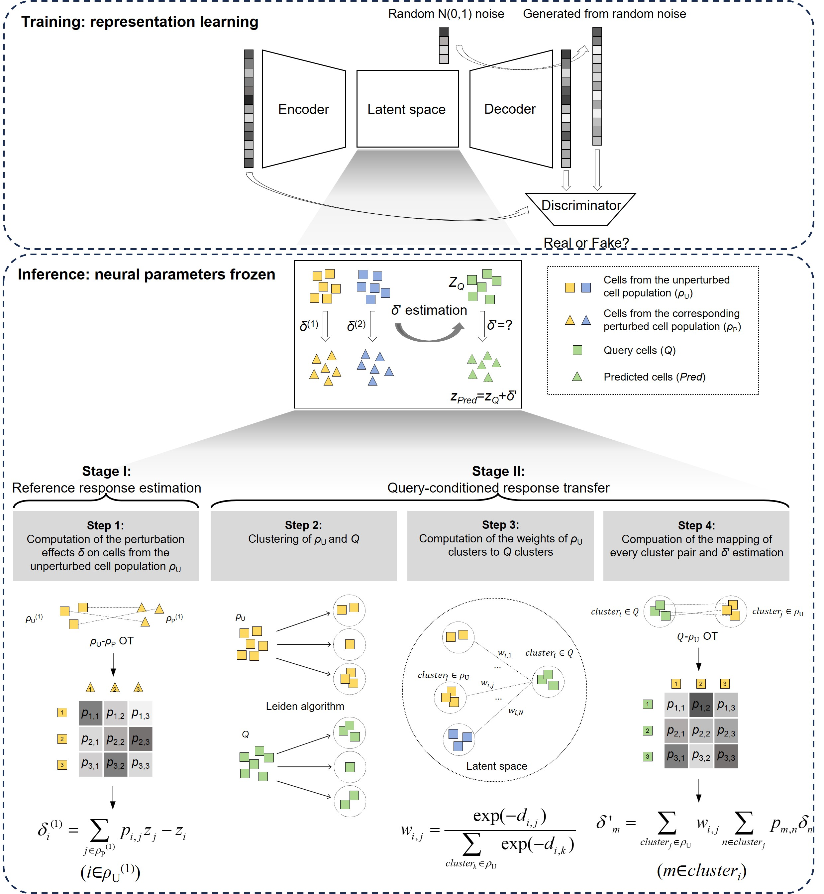

## Predicting single-cell perturbation responses across biological contexts with a deep generative model integrating optimal transport

**Authors**: \#Jialiang Wang, \#Ziqi Liu, \#Zhengqian Zhang, Yikun Cao, Junjun Ren, Peng Cheng, Jingjing Tian, Lingyun Xie, \*Xin Lu, \*Zhanwei Du, \*Yongzhuang Liu

\# Equal contribution.

\* Corresponding author.

<p align='center'> </p>

Predicting how single cells respond to perturbations is a central problem in computational biology, with potential relevance to emerging artificial intelligence virtual cell (AIVC) research and drug-discovery efforts. However, substantial variation in perturbation responses across biological contexts and the limited generalizability of current models make prediction across cell types, patients, species, and other contexts particularly challenging. To address this challenge, we present single-cell perturbation inference via latent optimal transport (scPILOT), a query-conditioned framework for transferring responses to previously observed perturbations across biological contexts. scPILOT learns a generative latent representation through discriminator-assisted training and separates perturbation inference into cell-level response estimation from observed contexts and query-specific response transfer using latent optimal transport. Across held-out cell-type, patient, and species benchmarks, scPILOT achieved context-averaged R<sup>2</sup><sub>mean</sub>/MMD<sup>2</sup> values of 0.945/0.137, 0.598/0.025, and 0.853/0.287, respectively. It also maintained strong population-average accuracy in a held-out cell-line benchmark, while complementary analyses indicated that performance was associated with dataset learnability and query–context match. With the continued expansion of single-cell perturbation datasets, scPILOT may provide a practical framework for transferring responses to previously observed perturbations across increasingly diverse biological contexts.

## Installation

To setup the corresponding `conda` environment run:
```
conda create --name scPILOT python=3.12.2
conda activate scPILOT
pip install --upgrade pip
```
Install requirements and dependencies via:
```
pip install adjustText==1.1.1
pip install anndata==0.10.6
pip install matplotlib==3.8.4
pip install numpy==1.26.4
pip install pandas==2.2.3
pip install POT==0.9.4
pip install scikit-learn==1.4.1.post1
pip install scipy==1.13.0
pip install scvi-tools==1.1.2
pip install seaborn==0.13.2
pip install setuptools==68.2.2
pip install torch==2.2.2
```
To install `scPILOT` run:
```
pip install -e .
```

## Datasets
The datasets used in this work can be downloaded from https://zenodo.org/records/17827977.

## Reproducibility
The results can be reproduced with the datasets and scripts we provide.

## Contact
In case you have questions, please contact Jialiang Wang through 18846091447@163.com.
